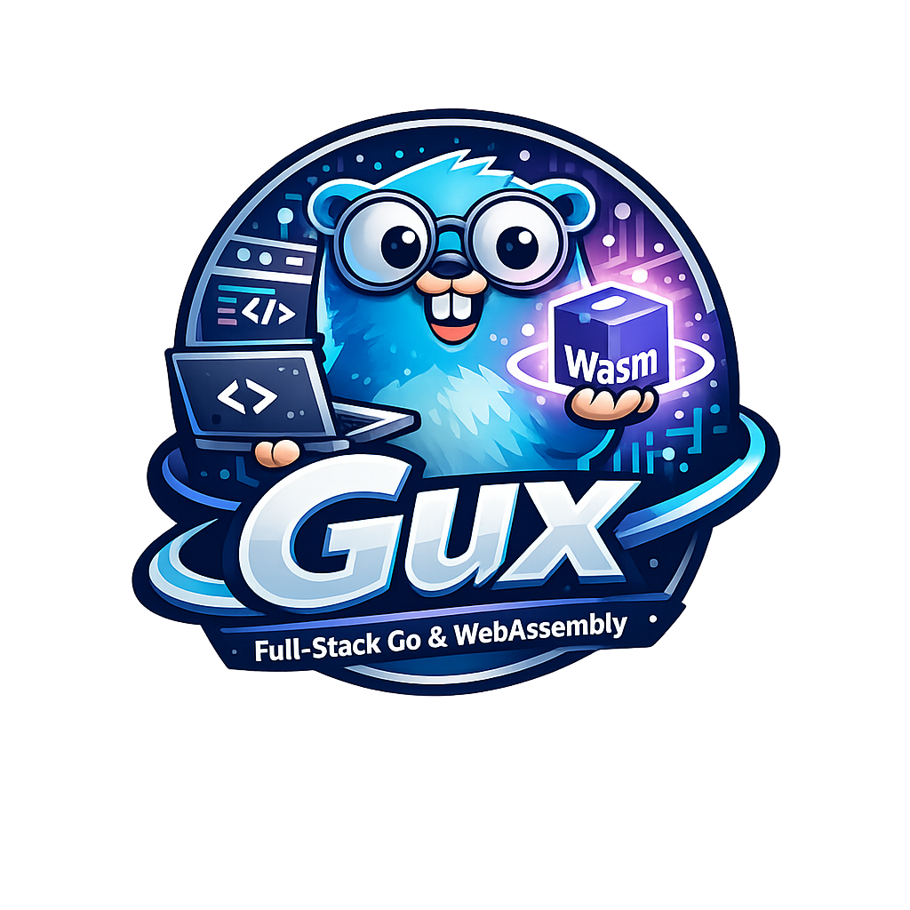

# Gux



A full-stack Go framework for building modern web applications with WebAssembly. Write your entire application in Go — from type-safe API clients to reactive UI components.

[](https://golang.org)
[](LICENSE)

**[Live Demo](https://gux-demo.production.app.dbb1.dev/)** — Try Gux in your browser

## Features

- **Type-Safe API Generation** — Define Go interfaces, generate HTTP clients and server handlers automatically
- **Universal Rendering** — SSR + WASM hydration with the core framework
- **CRUD API Generation** — Automatic REST endpoints from GORM models with DTOs
- **CSRF Protection** — Automatic Double Submit Cookie pattern for all mutations
- **Server Utilities** — Middleware composition, SPA handler, CORS, logging, and error handling
- **Go-Powered Frontend** — Compile to WebAssembly, run natively in the browser

## Quick Start

### Prerequisites

- Go 1.21+
- TinyGo 0.30+ (optional, for smaller WASM builds ~500KB vs ~5MB)

### Installation

```bash
# Install the Gux CLI tool
go install github.com/dougbarrett/gux/cmd/gux@latest
```

### Create a New App

```bash
# Scaffold a new application
gux init --module github.com/youruser/myapp myapp

# Run development server
cd myapp
gux dev       # Build and run at http://localhost:8080
```

This creates a minimal Gux application with:
- `cmd/app/main.go` — WASM frontend with router and layout
- `cmd/server/main.go` — HTTP server with SPA handler
- `internal/api/` — Example API interface for code generation
- `Dockerfile` — Multi-stage Docker build

Default files (index.html, manifest.json, service-worker.js, wasm_exec.js) are automatically injected at build time. To customize the HTML shell, create a `public/` directory with your own files.

### Generate API Code

```bash
# Generate client and server code from API interfaces
gux gen                  # Scans ./api directory
gux gen --dir src/api    # Custom directory
```

This finds all `.go` files with `@client` annotations and generates type-safe HTTP clients and server handlers.

### Run the Example

```bash
cd example
make dev-tinygo     # Build and start server

# Open http://localhost:8093
```

## How It Works

### 1. Define Your API Interface

```go
// api/posts.go
package api

import "context"

// @client PostsClient
// @basepath /api/posts
type PostsAPI interface {
    // @route GET /
    GetAll(ctx context.Context) ([]Post, error)

    // @route GET /{id}
    GetByID(ctx context.Context, id int) (*Post, error)

    // @route POST /
    Create(ctx context.Context, req CreatePostRequest) (*Post, error)

    // @route PUT /{id}
    Update(ctx context.Context, id int, req CreatePostRequest) (*Post, error)

    // @route DELETE /{id}
    Delete(ctx context.Context, id int) error
}
```

### 2. Generate Client & Server Code

```bash
gux gen
```

This scans the `api/` directory and generates:
- `posts_client_gen.go` — Type-safe HTTP client for WASM
- `posts_server_gen.go` — HTTP handler with automatic routing

### 3. Build Your Frontend

See the [examples/minimal](examples/minimal) directory for a complete reference implementation with:

- **Hybrid rendering** — SSR + WASM hydration
- **Route groups** — Public and admin routes with separate WASM bundles
- **CRUD with DTOs** — Users and Posts with secure field filtering
- **State management** — Server-side data loading with client hydration

### 4. Compile to WebAssembly

```bash
# Standard Go (larger output, ~5MB)
GOOS=js GOARCH=wasm go build -o main.wasm ./app

# TinyGo (smaller output, ~500KB)
tinygo build -o main.wasm -target wasm -no-debug ./app
```

### 5. Create Your Server

```go
package main

import (
    "net/http"
    "yourapp/api"
    "github.com/dougbarrett/gux/server"
)

func main() {
    mux := http.NewServeMux()

    // Wire up generated handler with your service
    service := NewPostsService()
    handler := api.NewPostsAPIHandler(service)

    // Add middleware
    handler.Use(
        server.Logger(),
        server.CORS(server.CORSOptions{}),
        server.Recover(),
    )
    handler.RegisterRoutes(mux)

    // Serve static files with SPA routing
    spa := server.NewSPAHandler("./static")
    mux.HandleFunc("/", spa.ServeHTTP)

    http.ListenAndServe(":8080", mux)
}
```

## Documentation

| Guide | Description |
|-------|-------------|
| [Getting Started](docs/getting-started.md) | Installation, setup, and first app |
| [API Generation](docs/api-generation.md) | Code generation annotations and usage |
| [Templates](docs/templates.md) | Page templates and patterns |
| [Server Utilities](docs/server.md) | Middleware and backend helpers |
| [Deployment](docs/deployment.md) | Docker and production setup |

## Core Framework

The `core/` package provides universal rendering that works identically on server (SSR) and client (WASM):

```go
import "github.com/dougbarrett/gux/core"

func MyPage(r *core.Router) func() core.Node {
    // Loader: runs on server for SSR, via API for client navigation
    var items []Item
    r.OnLoad(func() {
        // Fetch data
    })

    // Component: returns UI, re-runs on state changes
    return func() core.Node {
        count := r.StateInt("count", 0)

        return core.Div(core.Class("container"),
            core.H1(core.Attrs{}, core.Text("Items")),
            core.Button(core.Attrs{
                OnClick: func() { count.Set(count.Get() + 1) },
            }, core.Text("Increment")),
        )
    }
}
```

See [examples/minimal](examples/minimal) for complete patterns and best practices.

## State Management

```go
import "github.com/dougbarrett/gux/core"

func MyPage(r *core.Router) func() core.Node {
    return func() core.Node {
        // Typed state helpers
        count := r.StateInt("count", 0)
        name := r.StateString("name", "")
        active := r.StateBool("active", false)

        // Generic state for any type
        user := core.UseState(r, "user", User{Name: "Guest"})

        // Read state
        current := count.Get()

        // Update state (triggers re-render)
        count.Set(current + 1)

        // Update without re-render
        name.SetQuiet("new value")

        return core.Div(core.Class("container"))
    }
}
```


## Server Utilities

### Middleware

```go
// Compose middleware
handler := server.Chain(
    server.Logger(),      // Request logging
    server.CORS(opts),    // Cross-origin support
    server.Recover(),     // Panic recovery
    server.RequestID(),   // X-Request-ID header
)(apiHandler)
```

### Error Handling

```go
// Structured errors with HTTP status codes
if user == nil {
    return nil, api.NotFoundf("user %d not found", id)
}

if !valid {
    return nil, api.BadRequest("invalid email format")
}

// Automatic JSON error responses
// {"error": {"code": "not_found", "message": "user 123 not found"}}
```

### Pagination

```go
func handleList(w http.ResponseWriter, r *http.Request) {
    q := api.Query(r)
    search := q.String("search", "")
    page := q.Pagination() // Reads ?page=1&per_page=20

    items := fetchItems(search, page.Offset, page.PerPage)
    total := countItems(search)

    result := api.NewPaginatedResult(items, page, total)
    json.NewEncoder(w).Encode(result)
}
```


## Project Structure

```
gux/
├── api/            # Error handling, query utilities, pagination
├── cmd/gux/        # CLI tool (gux init, gux gen)
├── core/           # Universal rendering framework (SSR + WASM)
├── examples/       # Reference implementations
│   └── minimal/    # Complete app with hybrid rendering
├── fetch/          # Browser fetch API wrapper with CSRF
└── server/         # Middleware and SPA handler
```

## Deployment

### Docker

```bash
cd example
make docker       # Build image
make docker-run   # Run locally on :8080
```

The Dockerfile uses multi-stage builds:
1. **TinyGo** — Compiles WASM frontend (~500KB)
2. **Go** — Builds server binary
3. **Alpine** — Minimal production image (~20MB)

See [Deployment Guide](docs/deployment.md) for Kubernetes, fly.io, and other platforms.

## PWA Support

Gux applications can be installed as Progressive Web Apps:

- **Installable** — Add to home screen on mobile and desktop
- **Offline Support** — Service worker caches static assets
- **Asset Caching** — Cache-first strategy for optimal performance

The example application includes:
- `manifest.json` — App metadata, icons, theme colors
- `sw.js` — Service worker with intelligent caching
- Install prompt component with 7-day dismissal cooldown

```bash
# PWA files are in example/server/static/
example/server/static/manifest.json
example/server/static/sw.js
```

## Contributing

Contributions are welcome! Please:

1. Fork the repository
2. Create a feature branch (`git checkout -b feature/amazing`)
3. Commit your changes (`git commit -m 'Add amazing feature'`)
4. Push to the branch (`git push origin feature/amazing`)
5. Open a Pull Request

## License

MIT License — see [LICENSE](LICENSE) for details.
